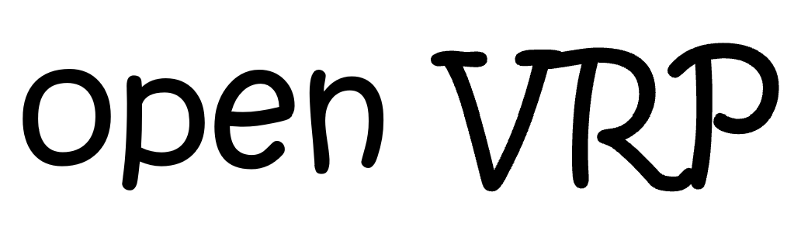
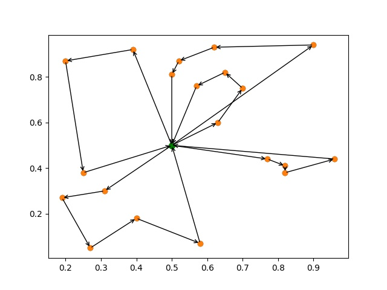

openVRP is a research platform that implements state-of-the-art Viechle-Routing-Problem(VRP)  algorithms.

## What's New

- [Apr 2022] First version written in python release

## Installation

```shell script
conda create -n openVRP python=3.8
conda activate openVRP
conda install -y matplotlib numpy
```

## Quick Start


```shell script
python ga_vrp.py
```

## Visualization




## License
Fastreid is released under the [Apache 2.0 license](LICENSE).

